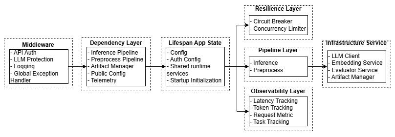
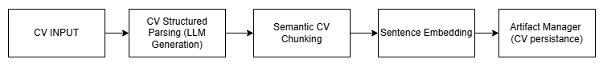
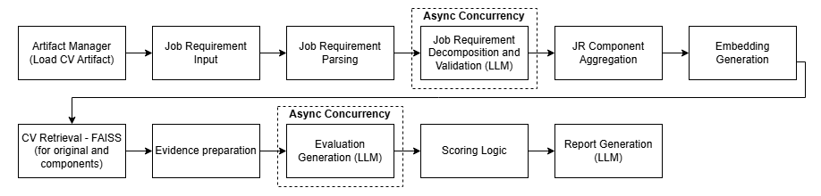
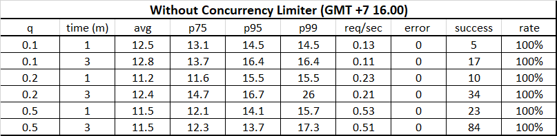

# CV Fit Signal — Multi-Step RAG Evaluation System
## Production-Oriented Multi-Step RAG System for Evidence-Based CV Evaluation
> A multi-step RAG system that evaluates CV fitness against job requirements by grounding decisions in explicit and implicit evidence retrieved from the candidate’s CV.

## Problem
- Traditional CV screening systems often rely on keyword matching, which struggles to capture implicit skills, contextual experience, and evidence quality.
* This project uses Retrieval-Augmented Generation (RAG) to improve CV evaluation by grounding scoring and reasoning in explicit and implicit evidence retrieved from the candidate’s CV.

## Current Status
See:
- DEV_NOTES.md

### Implemented (Stage 1–5)
- Structured JSON logging and request lifecycle observability
- Async multi-stage orchestration with stage-level concurrency governance
- Centralized LLM resilience system (circuit breaker, timeout strategy, malformed-response protection)
- FastAPI backend architecture (dependency injection, lifespan management, middleware, routing)
- API-key authentication and rate limiting with route-level access control
- Modular service-oriented pipelines with reusable CV artifact persistence
- Dockerized deployment workflow with reproducible containerized runtime environments
- Docker Compose orchestration with persistent runtime storage and environment-variable-driven configuration

### Current (Stage 6)
- Cloud deployment workflow
- Production deployment configuration
- Remote inference service hosting
- Deployment monitoring and logging

### Planned (Stage 7):
- Requirement weighting
- Improved reranking
- Advanced fit scoring
- Better ranking calibration

## Current Limitation
- Current inference orchestration uses batch-stage synchronization instead of streaming execution
- Evaluation stages wait for all decomposition tasks to complete before execution
- Telemetry storage is not yet separated into dedicated monitoring infrastructure
- Connection error retry classification is still limited
- High async fanout can amplify latency under sustained concurrency pressure
- Report generation currently cannot accept more than 15 Job Requirements
- Current containerized deployment workflow is optimized for CPU-oriented inference and does not yet provide dedicated GPU deployment/runtime support
- Current orchestration behavior is optimized for single-worker async execution and has not yet been fully stabilized for multi-worker deployment environments

## System Architecture
### 1. FastAPI Backend Architecture

- Note: Shared orchestration services are initialized during FastAPI lifespan startup and accessed through dependency injection.

### 2. Preprocess Pipeline

- Note: Preprocessing artifacts are persisted to reduce repeated parsing, embedding generation, and inference latency.

### 3. Inference Pipeline

- Note: The current orchestration uses batch-stage synchronization. Each asynchronous stage must fully complete before the next stage begins execution.


## Production-Oriented Features
* Structured JSON logging, observability, telemetry, and request lifecycle tracking
* Centralized LLM resilience system (circuit breaker, timeout strategy, retry handling, malformed-response repair)
* Async multi-stage orchestration with stage-level concurrency governance
* API-key authentication, route access control, and abuse protection
* CV artifact persistence, integrity validation, and semantic retrieval optimization
* Modular FastAPI backend architecture (dependency injection, lifespan management, middleware, config-driven behavior)
* Containerized deployment workflow with reproducible runtime environments
* Runtime persistence separation using Docker volume mounts and environment-variable-driven deployment configuration
* Healthcheck-based operational monitoring

## Example Output
- Evaluation Output:
```json
{
  "datetime": "07-05-2026 18:54",
  "name": "Ardi Pratama",
  "report": [
    {
      "query": "Experience applying machine learning techniques to real problems",
      "score": 0.425,
      "reason": "Your experience in building a classification pipeline and performing preprocessing tasks showcases your application of machine learning techniques. However, connecting this experience to a specific real-world problem would strengthen the evaluation further."
    },
    {
      "query": "Familiarity with containerization tools (e.g., Docker)",
      "score": 0.0,
      "reason": "No supporting evidence related to containerization tools such as Docker was identified in the CV."
    }
  ],
  "final_score": 0.215
}
```

## Concurrency & Load Testing
The system includes stage-level concurrency analysis and sustained load testing using `oha` and `hey`.



Key findings:
- asynchronous orchestration significantly reduced stage latency under moderate concurrent workloads
- stage-level concurrency saturation points were identified for decomposition and evaluation stages
- uncontrolled async fanout caused orchestration instability under sustained load
- stage-level concurrency governance improved workload stability and upstream survivability
- sustained load testing eventually triggered upstream OpenAI rate limiting after approximately ~300 inference requests under concurrent orchestration workloads (5 Job Requirement)

See:
- docs/CONCURRENCY_LOAD_TEST_ANALYSIS.md
- docs/LATENCY_ANALYSIS.md

## Observability & Telemetry
The system is designed with observability-first principles to improve debugging, optimization, and operational visibility during inference execution.

Tracked telemetry includes:
- stage-level pipeline latency
- LLM prompt and completion token usage
- estimated LLM request cost
- structured runtime logs

Purpose:
- identify latency bottlenecks
- analyze token consumption
- improve debugging workflow
- support future production deployment and monitoring

Example:
- Latency Telemetry:
```json
{"levelname": "INFO", 
"name": "src.pipelines.inference_pipeline", 
"message": "API predicted", 
"timestamp": "19-05-2026_16:42", 
"environment": "v.1.3", 
"taskName": "inference-ardi_pratama", 
"layer": "pipeline", 
"stage": "inference_service", 
"latencies": {
  "inf_chunk": 2323.35, 
  "inf_embed": 636.37, 
  "inf_evaluation": 4079.73, 
  "inf_report": 3646.95, 
  "inf_predict_api": 10702.25}}
```

- Token Usage Telemetry
```json
{"levelname": "INFO", 
"name": "src.pipelines.inference_pipeline", 
"message": "Token Tracked", 
"timestamp": "19-05-2026_16:42", 
"environment": "v.1.3", 
"taskName": "inference-ardi_pratama", 
"layer": "pipeline", 
"stage": "inference_service", 
"summary": {
  "total_prompt_tokens": 5782, 
  "total_completion_tokens": 1371, 
  "total_cost_idr": 29.067, 
  "tokens_history": {
      "inf_chunk": {"prompt_token": 1675, "completion_tokens": 278}, 
      "inf_evaluation": {"prompt_token": 3627, "completion_tokens": 848}, 
      "inf_report": {"prompt_token": 480, "completion_tokens": 245}}}}
```
See:
- docs/LATENCY_ANALYSIS.md:
- docs/TOKEN_USAGE_ANALYSIS.md:

## Failure Handling
The system includes centralized failure handling to improve robustness and reduce invalid pipeline execution.

Implemented handling includes:
- system-level exception categorization:
  - configuration errors
  - preprocess pipeline errors
  - inference pipeline errors
  - LLM-related errors
- automatic JSON repair for invalid structured LLM output
- configurable timeout and retry mechanism
- retrieval threshold filtering
- artifact validation and integrity checking
- invalid CV input validation
- bootstrap logger fallback before structured logger initialization
- business-logic validation and repair for invalid job requirement decomposition

Example validation log:
```json
{
  "levelname": "WARNING",
  "name": "src.services.chunker",
  "message": "Repairing invalid JR requirement",
  "timestamp": "12/05/2026_22:05",
  "environment": "v.1.2",
  "stage": "inf_chunk_repair",
  "invalid_components": [
    "for operational workflows",
    "for business workflows"
  ]
}
```

## Key Design Decisions
- Combined component-level retrieval with full job requirement retrieval to improve evaluation context coverage
- Separated evaluation into:
  - capability level
  - evidence strength
  - responsibility multiplier
- Performed structured scoring outside the LLM for more deterministic and explainable scoring behavior
- Introduced reusable CV artifact persistence to reduce repeated preprocessing, token usage, and inference latency
- Used semantic retrieval instead of keyword-only matching to capture implicit capability signals
- Added retrieval threshold filtering to reduce hallucination risk from unrelated evidence
- Centralized LLM interaction and failure handling inside a dedicated LLM client
- Structured the system using modular service-oriented pipelines for maintainability, observability, and future API deployment

## Runtime & Deployment Strategy
### Optimized CPU Inference
- ONNX Runtime execution backend
- optimized embedding inference pipeline
- preferred deployment strategy for lightweight production workloads
### Optional GPU Inference
- native PyTorch CUDA runtime
- runtime CUDA availability detection
- experimental deployment configuration for future high-throughput workloads
### Containerized Deployment
- reproducible runtime environments
- isolated dependency management
- persistent runtime separation
- simplified deployment orchestration

## Documentation
1. docs/DEV_NOTES.md:
    - Architecture decisions, tradeoffs, observed challenges, limitations, and development notes
2. docs/LATENCY_ANALYSIS.md:
    - Pipeline latency analysis and performance comparison across versions
3. docs/TOKEN_USAGE_ANALYSIS.md:
    - LLM token usage and cost analysis across versions
4. docs/LLM_GENERATION.md:
    - LLM generation realibility analysis
5. docs/CONCURRENCY_LOAD_TEST_ANALYSIS.md
    - Concurrency for LLM upstream analysis
    - Load test analysis

## How to Run
1. Configure environment variables
    - Open `.env.example`
    - Follow the instructions inside the file
2. Configure system behavior
    - Edit `config.yaml`
3. Start containerized services
    - `docker compose up --build cv-fit-signal`
4. Stop services
    - `docker compose down`
5. Access API Documentation
    - Swagger UI: `http://localhost:8000/docs`

### Optional Local Runtime
1. Run CV preprocessing pipeline
    - `python -m src.core.main_preprocess`
2. Run inference pipeline
    - `python -m src.core.main_inference`
3. Run API
  - `uvicorn src.core.main_api:app`

## Author
Jearim Jarden