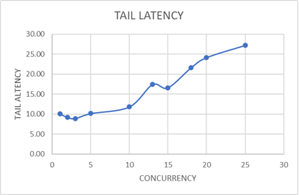
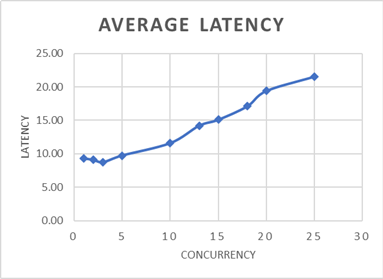
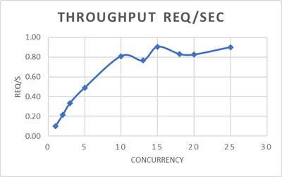
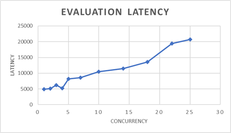
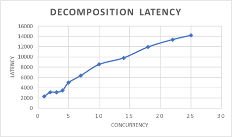
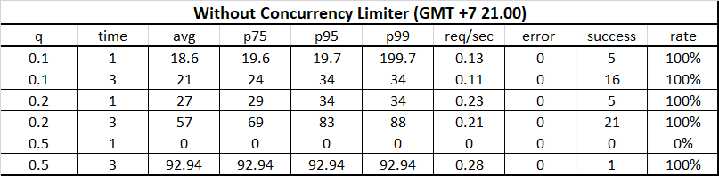
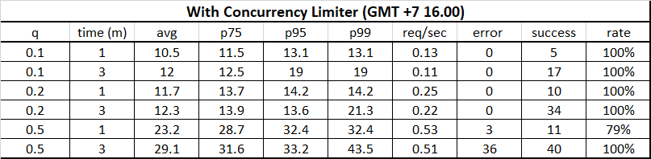

# Concurrency and Load Test Analysis
This analysis evaluates stage-level concurrency saturation behavior for upstream OpenAI generation requests. Concurrency testing was performed using `hey`, while sustained load testing was performed using `oha`.

Load testing measures:
- sustainable concurrency
- latency amplification
- throughput behavior
- saturation characteristics under concurrent load

## CV-fit RAG System v1.3 (18 May 2026)
System Architecture:
- CV Preprocess Pipeline:
  - CV Parsing - LLM
  - Semantic Chunking
  - Embedding Generation 
  - Artifact Persistance

- Inference Pipeline:
  - Load CV Artifact + Job Requirement
  - Job Requirement parsing
  - Requirement Decomposition - LLM (asynchronous)
  - Embedding Generation
  - Semantic Retrieval
  - Evidence Preparation
  - Evidence based Evaluation - LLM (asynchronous)
  - Structured Scoring
  - Report Generation - LLM (asynchronous)

Request Architecture:
- Requirement decomposition and evaluation stages use batch-stage synchronization
- All job requirement tasks must complete before progressing to the next stage
- Current orchestration uses batch-stage synchronization instead of streaming execution

### Analysis 1 (Preprocess concurrency)
#### Latency Result
Tail Latency:

Average Latency:

Average req/sec:

#### Summary:
- Tail latency remained relatively stable between concurrency 1-10, then increased sharply after concurrency 15
- Average latency increased gradually until concurrency 10, then amplified under higher concurrent load
- Throughput (req/sec) plateaued around concurrency 10, indicating upstream saturation
- The preprocess pipeline maintains the best latency-throughput tradeoff around ~10 concurrency

### Analysis 2 (Inference concurrency)
#### Latency Result
Evaluation Latency:

Decomposition Latency:

#### Summary:
- Evaluation latency showed minor amplification between concurrency 5-7 and remained relatively stable until around concurrency 12
- Evaluation latency increased significantly after concurrency 15, indicating upstream saturation pressure
- Decomposition latency remained relatively stable between concurrency 1-5
- Decomposition latency increased progressively after concurrency 5, indicating earlier saturation compared to evaluation
- Evaluation stages tolerated higher concurrency more effectively than decomposition stages under sustained load

### Analysis 3 (Load Test)
#### Configuration
Variable:
- cv_chunked = 27
- jr_parsed = 5

Concurrency Limiter (limit, timeout):
chunking = 6, 20
evaluation = 10, 35
report = 1, 20

#### Latency Result
Without concurrency limiter:
1. GMT +7 16:00

With concurrency limiter:
1. GMT +7 21:00

2. GMT +7 16:00

#### Summary:
- Concurrency governance reduced orchestration instability under sustained concurrent load
- Systems without concurrency governance showed severe latency amplification during higher upstream congestion periods
- At GMT+7 21:00, non-limited orchestration partially collapsed under q=0.5 sustained load
- Stage-level concurrency limiting improved workload stability by preventing uncontrolled async fanout
- Upstream inference congestion significantly affected sustained load behavior depending on runtime conditions
- sustained load testing eventually triggered upstream OpenAI rate limiting after approximately ~300 inference requests under concurrent orchestration workloads